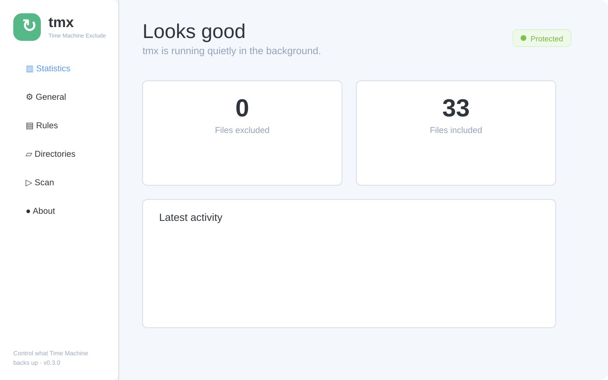
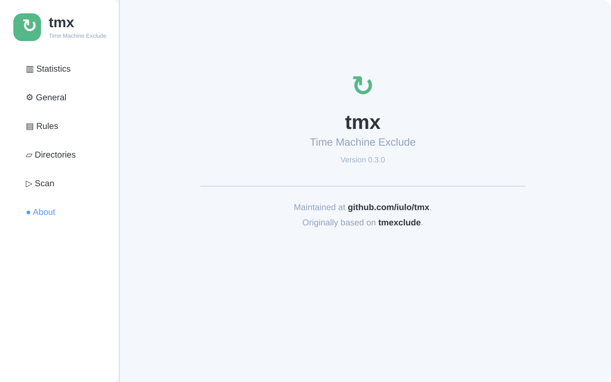

# tmx

tmx is a macOS menu bar utility for keeping selected files and directories out of Time Machine backups. It watches the filesystem incrementally, applies your rules as files change, and also provides a full scan when you want to reconcile everything manually.

## Original project

This project is maintained at [github.com/iulo/tmx](https://github.com/iulo/tmx) and continues [TimeMachine Exclude (tmexclude)](https://github.com/PhotonQuantum/tmexclude) by [LightQuantum](https://github.com/PhotonQuantum). The original source is licensed under the [MIT License](LICENSE.txt), and its commit history and copyright notices are retained.

## Features

- Incremental filesystem monitoring with event batching to avoid repeated work during large operations such as `pnpm install`.
- Rules for common generated directories, including `node_modules` and Rust `target` directories.
- Manual scan, statistics, directory management, and a compact menu bar window.
- English and Chinese UI translations.

## Installation

Download a release from this repository's [Releases](../../releases) page, or build locally on macOS:

```sh
pnpm install --frozen-lockfile
pnpm tauri build
```

For development, run `pnpm tauri dev`. Rust, Node.js, pnpm, and the macOS development tools are required. Use `pnpm dev` when you only need the Vite frontend.

The frontend uses Vue 3 SFCs with `<script setup>`, Vite, Pinia, Element Plus, and UnoCSS with a Tailwind 4 compatible preset. The native shell is built with Tauri 2.

Run the project checks before opening a pull request:

```sh
pnpm check
cargo check --manifest-path src-tauri/Cargo.toml
```

## Configuration

You can configure tmx in the GUI or edit `~/.config/tmexclude.yaml`. This legacy filename is retained so existing rules load after upgrading. Restart the app after manual edits. See [config.example.yaml](config.example.yaml) for an example.

## Screenshots




## License

[MIT](LICENSE.txt)
